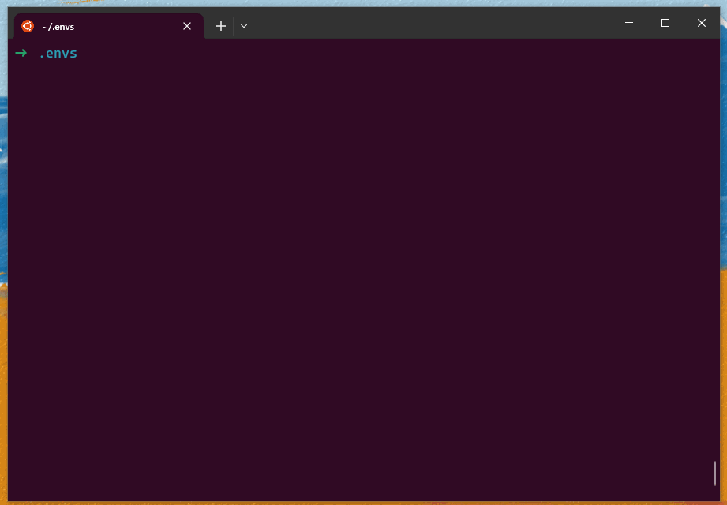
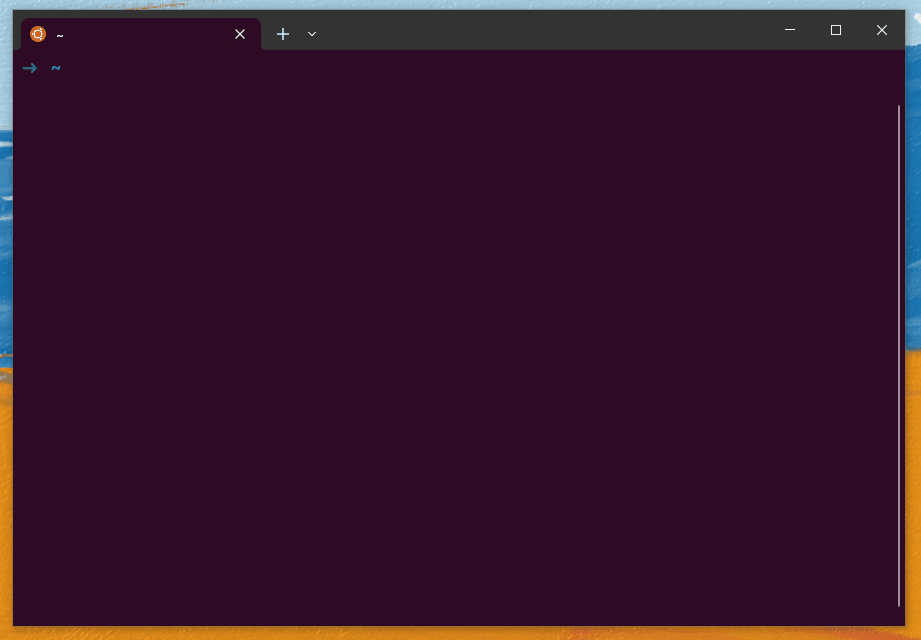
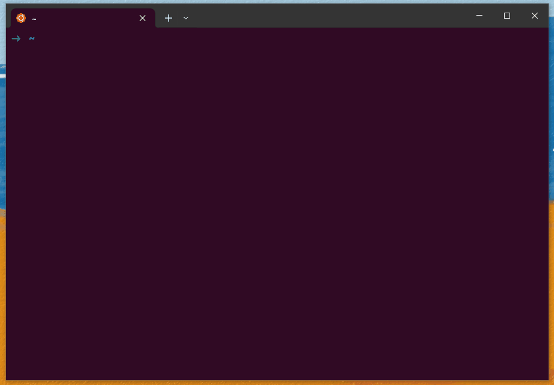

# Compiler la documentation avec *Sphinx*

*Sphinx* permet de générer de la documentation sous différentes formes comme des pages html ou un document pdf depuis des fichiers texte en *Markdown* ou en *reStructuredText*.

Il est possible de compiler cette documentation en local mais aussi de l'intégrer dans une chaîne d'intégration continue sur gitlab ou github pour déployer des pages par exemple.

La documentation de *Sphinx* est disponible ici : [https://www.sphinx-doc.org/_/downloads/en/master/pdf/](https://www.sphinx-doc.org/_/downloads/en/master/pdf/).

## Organisation du répertoire

Voyons un peu ce que contient le dépôt :

```bash 
documentation
├── .gitignore
├── .gitlab-ci.yml
├── README.md
├── build-doc.md
└── documentation
    ├── Makefile
    ├── _build
    ├── _static
    ├── _templates
    ├── content
    ├── make.bat
    └── requirements.txt
```

* .gitignore : ce qui est ignoré lors des commits git
* .gitlab-ci.yml : fichier d'intégratio continue de gitlab
* README.md : document visible sur l'interface web gitlab;
* build-doc.md : ce document qui explique comment utiliser sphinx
* répertoire *documentation* :
    * Makefile : fichier de compilation de sphinx
    * répertoire *_build* : contient les pages html générées en local (n'existe pas sur gitlab car inclus dans .gitignore)
    * répertoire *_static* : contient des fichiers de configuration pour la génération des pages html
    * répertoire *_templates* : contient la personnalisation du pied de page pour les pages html
    * **répertoire *content* : c'est ici que l'on met le contenu de la documentation (index, fichiers .md, figures, etc.)**
    * make.bat : également pour la compilation
    * requirements.txt : dépendances nécessaires pour la génération de la documentation

Pour ajouter du contenu à la documentation, tout se passe dans le répertoire *content*.

### Ajouter du contenu à la documentation

```bash
content
├── conf.py
├── img
├── index.rst
└── overview.md
```

* conf.py : contient la configuration du projet *sphinx*, notamment :
    * le nom du projet;
    * le logo du projet;
    * etc.

    ```python
    # -- Project information -----------------------------------------------------

    project = 'Robothon - Polytech Sorbonne'
    copyright = '2024, ISIR, Sorbonne Université, CNRS, INSERM' 
    author = 'Author'
    release = '0.1'
    ```

* répertoire *img* : comme son nom l'indique, pour y mettre les figures
* index.rst : pages html à compiler
* environnement.md et vue-ensemble.md : des documents .md qu'on vient ajouter à l'index

## Générer les pages html en local

### 1. Créer un environnement virtuel qui contient toutes les dépendances nécessaires (à faire juste une fois);

```bash
# création de l'environnement (dans le répertoire $VENV_DIR qu'il faut choisir)
$ python3 -m venv $VENV_DIR/sphinx_env


# se placer dans l'environnement
$ source $VENV_DIR/sphinx_env/bin/activate

# installer les dépendances
$ python3 -m pip install -U sphinx
$ python3 -m pip install -r requirements.txt
```

En images :



### 2. Sourcer l'environnement virtuel

```bash
source $VENV_DIR/sphinx_env/bin/activate
```

C'est un peu pénible à taper donc il est aussi possible de créer un alias.

```bash
# si bash
echo "alias env_sphinx="source ~/.envs/sphinx_env/bin/activate"" >> ~/.bashrc 
source ~/.bashrc
sphinx_env 
```



### 3. Générer les pages HTML dans le répertoire `documentation/_build`;

```bash
$ cd $PROJET_DIR/documentation
$ sphinx-build -b html content _build
```


Les pages compilées sont alors dans le répertoire *_build*, index.html permet d'accéder à la page principale.

## Intégrer la compilation à l'intégration continue de gitlab et déployer la documentation sur *Pages*

L'intégration continue permet de déployer des pages html sur gitlab.

La configuration se fait dans le fichier *.gitlab-ci.yml*.

*Note* : Il y a actuellement un problème d'espace disque sur le serveur donc on ne peut pas utiliser les *runners* gitlab.

## Générer un document pdf

**Ressources** :

https://www.sphinx-doc.org/en/master/usage/builders/index.html#sphinx.builders.latex.LaTeXBuilder

**Pré-requis** :
- Environnement *Sphinx*

    ```bash
    $ source $VENV_DIR/sphinx_env/bin/activate
    # ou alors, si on a créé un alias
    $ sphinx_env
    ```

- Installation LaTeX

    - Indispensable

        ```bash
        $ sudo apt install texlive-latex-recommended texlive-fonts-recommended tex-gyre texlive-latex-extra latexmk
        ```

    - Optionnel

        ```bash
        $ sudo apt install texlive-lang-all # pour utiliser le français avec babel
        ```

**Compilation** :
```bash
$ cd $PROJET_DIR/documentation
$ sphinx-build -M latexpdf content _pdf/
```
