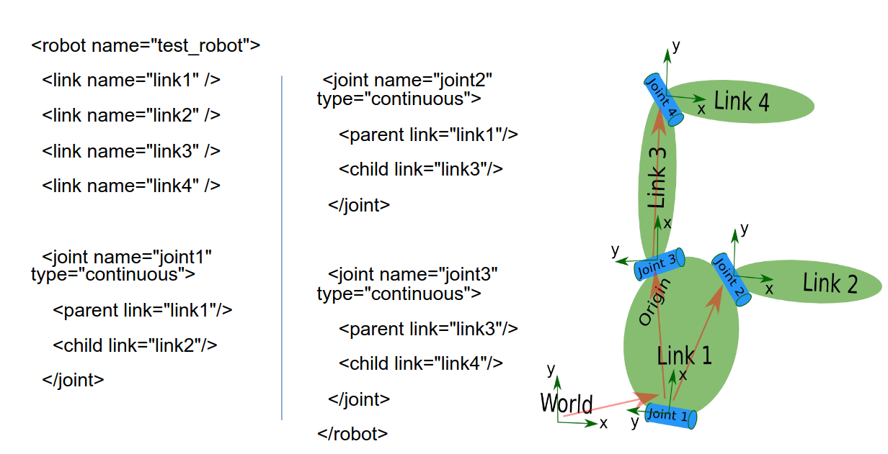
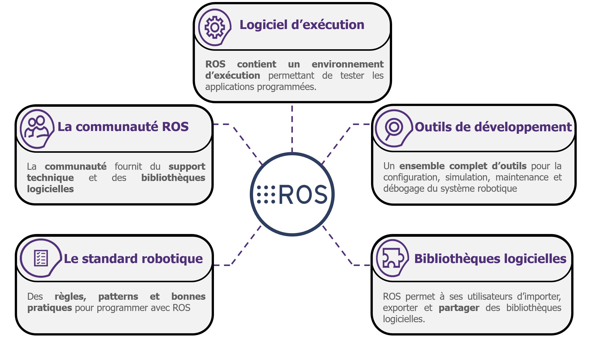
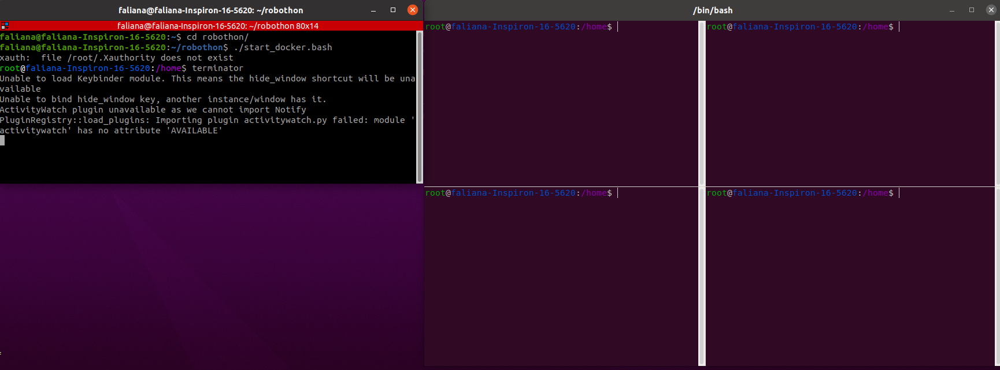

# Architecture logiciel

<style>
    .image{
    border: 5px solid #116aa4;
    border-radius: 10px;
    /* padding: 2px; */
    }
</style>

## Installation de Docker avec ROS et tous les packages nécessaires
<p>Logiciels installés (incluant environnement, et OS à avoir) :</p>
<ul class="simple">
<div class="demarrage" align="justify">
<li><p>Linux (Ubuntu, peu importe la version car on va utiliser Docker),</p></li>
<li><p>Docker (pour pouvoir contenir ROS Noetic qui n’est utilisable que sous Ubuntu version 20.04),</p></li>
<li><p>ROS1 Noetic (”<em>Robotic Operating System</em>” installé dans Docker),</p></li>
<li><p>Terminator (gestionnaire de terminal pour faciliter la compilation de plusieurs programmes en ayant un oeil sur les autres en train de tourner).</p></li>

<table align="center" cellspacing="10" cellpadding="5" style="width: 50%">
    <tr>
        <th>
            
        </th>
        <th>
            
        </th>
        <th>
            
        </th>
    </tr>
</table>


```{mermaid}
---
caption: Logos de Ubuntu et de Docker
align: 'center'
---
graph LR

```

<table align="center" cellspacing="10" cellpadding="5" >
    <tr>
        <th></th>
        <th></th>
        <th></th>
    </tr>
</table>

```{mermaid}
---
caption: Logos de ROS Noetic et Terminator
align: 'center'
---
graph LR

```

</div>
</ul>

## ROS 1 (Version Noetic)

<a class="reference external" href="https://ros.org">ROS</a> ou **Robotic Operating System** nous permet dans ce projet de pouvoir simuler des déplacements du bras de robot à l'aide de logiciels de simulation tels que RVIZ (pour l'affichage des différents repères ou TF au niveau des articulations du robot et de n'importe quel corps intégré à RVIZ) et Gazebo (pour les retours de forces pĥysiques), mais aussi de pouvoir planifier des mouvements et des trajectoires réels pour pouvoir faire des tâches de manipulation à l'aide de l'effecteur finale (constitué de pinces pour la saisie en fonction  des surfaces) comme dans notre cas.

<table align="center" cellspacing="20" cellpadding="5" style="width: 100%">
    <tr>
      <th>
        <div class="image">
          
        </div>
      </th>    
    </tr>
</table>

```{mermaid}
---
caption: Aperçu d'une simulation sur RVIZ et Gazebo (affichage du robot Panda Franka Emika)
align: 'center'
---
graph LR

```


### Les avantages majeurs de ROS

ROS permet de faire le lien entre différents modules et programmes, développés indépendemment les uns des autres grâceau lancement de noeuds qui est possible dans un fichier de lancement ou un "*launchfile*" qui peut générer plusieurs noeuds ROS en même temps, se basant sur des scripts soit Python, soit en C++, ce qui est un réel avantage en terme de codage dans le cas où le programme nécessite un niveau de fiabilité le plus élevé possible ou juste un niveau de programmation assez simple et facile de compréhension. On peut aussi représenter des systèmes entiers comme un robot, ou encore une boîte, géométriquement parlant avec les fichiers de format URDF qui permet de relier différentes articulations entre elles (ou les "*joint*" sur RVIZ), et de pouvoir définir des TFs et pouvoir illustrer l'aspect solide ou pas des articulations avec l'intégration de *collision* dans les paramètres.

<table align="center" cellspacing="20" cellpadding="5" style="width: 70%">
    <tr>
      <th>
        <div class="image">
          
        </div>
      </th>    
    </tr>
</table>

```{mermaid}
---
caption: Exemple d'un fichier URDF avec le code associé
align: 'center'
---
graph LR

```

### Ressources pour créer un URDF et comprendre le fonctionnement de ce type de fichier

- <http://wiki.ros.org/urdf/Tutorials/Create%20your%20own%20urdf%20file>
- <http://wiki.ros.org/urdf/Tutorials/Parse%20a%20urdf%20file>
- <http://wiki.ros.org/urdf/Tutorials/Building%20a%20Movable%20Robot%20Model%20with%20URDF>

A l'aide des différents éléments de ROS (les services, les messages, les paramètres, les Publishers et les Subscribers), on peut en même temps avoir accès aux données en temps réel du robot (position, orientation), mais on peut aussi lui indiquer un mouvement ou une position à atteindre (à l'aide d'un Publisher). Bien-sûr tout cela fait en temps réel d'où la nécessité d'un noyau Linux Ubuntu RT (Real Time) pour pouvoir fluidifier au maximum les déplacements du robot en fonction du temps.

<table align="center" cellspacing="20" cellpadding="5" style="width: 50%">
    <tr>
      <th>
        <div class="image">
          
        </div>
      </th>    
    </tr>
</table>

```{mermaid}
---
caption: Les différents domaines d'utilisation de ROS
align: 'center'
---
graph LR

```

<table align="center" cellspacing="20" cellpadding="5" style="width: 50%">
    <tr>
      <th>
        <div class="image">
          
        </div>
      </th>
    </tr>  
</table>
<table align="center" cellspacing="20" cellpadding="5" style="width: 70%">
    <tr>
      <th>
        <div class="image">
          
        </div>
      </th>
    </tr>
</table>

```{mermaid}
---
caption: Description générale de ROS avec le concept de base
align: 'center'
---
graph LR

```

L'image ci-dessus illustre les concepts de base de ROS concernant la communication entre les nœuds. Voici une description succincte des principaux concepts représentés :

- Nœuds (<a class="reference external" href="http://wiki.ros.org/fr/ROS/Tutorials/UnderstandingNodes">Nodes</a>) : Les nœuds sont des processus individuels qui effectuent des tâches spécifiques. Ils peuvent communiquer entre eux pour coordonner leurs actions.

- Services (<a class="reference external" href="http://wiki.ros.org/Services">Service</a>) : Un service permet une communication synchrone entre deux nœuds. Un nœud peut demander un service à un autre nœud et attendre une réponse. Cela est représenté par une connexion directe entre deux nœuds via le service.

- <a class="reference external" href="http://wiki.ros.org/Topics">Topic</a> : Les topics permettent une communication asynchrone entre les nœuds. Les nœuds peuvent publier des messages sur un topic ou s'abonner à un topic pour recevoir des messages. Cela permet une diffusion de l'information d'un nœud vers plusieurs nœuds sans connexion directe entre chaque pair de nœuds.

- Publications et Abonnements (Publication, Subscription avec <a class="reference external" href="http://wiki.ros.org/fr/ROS/Tutorials/UnderstandingNodes">python</a> ou avec <a class="reference external" href="http://wiki.ros.org/ROS/Tutorials/WritingPublisherSubscriber%28c%2B%2B%29">C++</a>) : Un nœud qui publie des messages sur un topic envoie de l'information, tandis qu'un nœud qui s'abonne à un topic reçoit les messages publiés. Un même topic peut avoir plusieurs nœuds éditeurs (publishers) et plusieurs nœuds abonnés (subscribers).

- Dans ROS (Robot Operating System), un callback est une fonction qui est appelée automatiquement lorsqu'un certain événement se produit, comme la réception d'un message sur un topic ou l'arrivée d'une requête de service.


## Qu’est-ce que “Docker” ?
<div class="demarrage" align="justify">
<p>Docker est une plateforme open source qui automatise le déploiement d’applications dans des conteneurs légers. Un conteneur regroupe l’application et toutes ses dépendances dans un seul paquet, garantissant que l’application fonctionne de manière cohérente, quel que soit l’environnement, donc indépendante à l’OS dans lequel il est. Docker permet de créer, déployer et gérer ces conteneurs de manière efficace, offrant ainsi une solution portable et flexible pour le développement et le déploiement d’applications. Il simplifie également la gestion des versions et des configurations, facilitant la collaboration entre les équipes de développement et d’exploitation.</p>
<p>Dans notre cas, on l’utilise pour la gestion de version, donc pouvoir utiliser ROS Noetic même avec un OS Ubuntu version 22.04, qui de base n’est pas compatible avec cette version de ROS, mais on utilise aussi Docker pour harmoniser les environnements sur chacun de nos appareils (les ordinateurs auront donc la même configuration et les mêmes pachages une fois que l’image Docker est compilée).</p>
</div>

<table align="center" cellspacing="10" cellpadding="5" style="width: 100%">
    <tr>
        <th>
            <div class="image"></div>
        </th>
    </tr>
</table>

```{mermaid}
---
caption: Aperçu lors du lancement de Docker
align: 'center'
---
graph LR

```

## Présentation des sous-modules (packages)

Les modules et codes développés durant ce projet sont disponibles en open-source sur le gitlab de Sorbonne Université à ce <a class="reference external" href="https://gitlabsu.sorbonne-universite.fr/robothon-sorbonne">lien</a>. Le repository "*robothon-sorbonne*" contient tous les packages avec tous les scripts et launchfile pour la réalisation des différentes tâches avec la perception de la task-board mais aussi la planification de trajectoires, vous avez ci-dessous un aperçu de l'arborescence des différents modules :

```{mermaid}
---
caption: Arborescence des sous-modules
align: 'center'
---
graph LR
  A(robothon-sorbonne) --> B[box_localization]
  A(robothon-sorbonne) --> C[visual_control]
  A(robothon-sorbonne) --> D[combined]
  A(robothon-sorbonne) --> E[trajectory]
  A(robothon-sorbonne) --> F[Probe_task]
  A(robothon-sorbonne) --> G[easy_handeye]

```

## Structure logiciel pour la perception et la planification de trajectoires

Il faut savoir qu'on a organisé l'arborescence de nos programmes de sorte à ce qu'on ait un "*superviseur*" qui permet de lancer tous les scripts des différentes tâches en fonction de la requête de l'utilisateur dans le terminal sur la tâche à exécuter. Bien évidemment avant tout planification de trajectoires, il faut d'abord localiser la boîte avec <a class="reference internal" href="SIFT.html">SIFT</a>, puis ensuite faire le choix d'être seulement en simulation ou non, et enfin choisir la tâche. 

Par définition, une "**primitive**" est une tâche primaire ou une brique logicielle qui permet de réaliser une tâche, en associant une chaîne de caractères (le nom de la tâche) pour l'exécution directe de la tâche.

Un diagramme détaille correctement le raisonnement ci-dessous :


```{mermaid}
---
caption: Architecture logiciel
align: 'center'
---

graph TD
Z[Launchfile : franka_positions.launch] --> A[Contrôlleur : franka_controller]
A -- paramètre simulation = false --> B(Robot réel)
A -- paramètre simulation = true --> C(Simulation avec Gazebo)
Z --> D[Superviseur : positions.py]
D --> H(Tâches)
H --> A
Z -- paramètre camera = true --> E[Caméra + box_localization]
Z --> F[RVIZ]
Z --> G[URDF : Modèle de la boîte]
G <--> F
E -- Calcul de la position --> G
G <--> Robot
Robot --> F

subgraph Robot
  B
  C
end

```

A partir de ce diagramme, on identifie "*Gazebo*" comme un logiciel permettant d'avoir un retour de force, et RVIZ est là que pour la visualisation de la simulation avec les différents TFs ou repères au niveau de la task-board et au niveau du bras de robot Panda. Le "`superviseur`" est relié au fichier de lanchement ("`franka_positions.launch`") permet de générer le noeud à partir de ce script, et c'est après qu'il lance ls différents scripts pour chaque tâche.


```{mermaid}
---
caption: Détail des différentes tâches à exécuter
align: 'center'
---
graph TD
  Y(Launchfile : franka_positions.launch) --> A(Superviseur : positions.py)

  A(Superviseur : positions.py) -- paramètre simulation = false --> B[Robot Réel]
  A(Superviseur : positions.py) -- paramètre simulation = true --> C[Simulation avec Gazebo]
  C -- paramètre simulation = false --> B
  B --> D[Tâche du bouton]
  B --> E[Tâche du slider]
  B --> F[Déplacement du connecteur de la sonde]
  B --> G[Ouverture de la trappe]
  B --> H[Tache de la sonde]
  C --> D[Tâche du bouton]
  C --> E[Tâche du slider]
  C --> F[Déplacement du connecteur de la sonde]
  C --> G[Ouverture de la trappe]
  C --> H[Tache de la sonde]

```

Ci-dessus, on a le diagramme montrant les différentes tâches que le superviseur permet de lancer ces tâches tant pour la simulation que le déplacement du robot réel.


<!-- ## Démarche mise en œuvre our la tâche : appuyer sur un bouton (cas d'usage)

1. **Localiser la boîte (sift)**
   - Entrée : Image
   - Sortie : Transformation `Tf(boîte/caméra)`

2. **Localiser la boîte par rapport au robot (sift)**
   - Entrée : Transformation `Tf(boîte/caméra)`
   - Sortie : Transformation `Tf(boîte/robot)`

3. **Position initiale du robot**
   - Entrée : Transformation `Tf(boîte/robot)`

### Etat de la boîte
- Transformation de l'état de la boîte : `Tf(boîte/caméra)` -> `Tf(boîte/robot)`

4. **Asservissement visuel (OpenCV)**
   - Entrée : Image
   - Sortie : Vitesse

5. **Commande du robot (mouvement dans l’espace opérationnel)**
   - Entrée : Vitesse

### Finalité
- Va permettre de se placer au dessus du bouton -->

