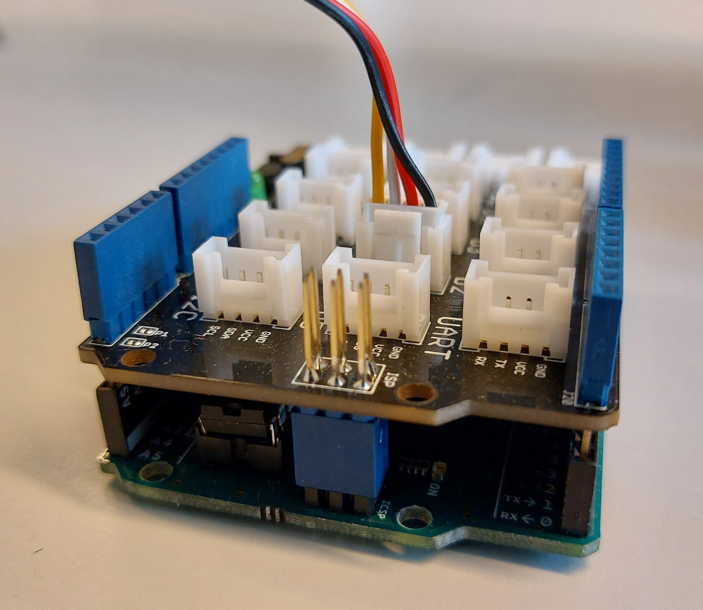

# Configuration matérielle

<style>
    .image{
    border: 5px solid #116aa4;
    border-radius: 10px;
    /* paddng: 2px; */
    }
</style>


## Matériel utilisé

<ul class="simple">
<li><p>Bras de robot Panda Franka Emika</p></li>
<li><p>La “task-board”</p></li>
<li><p>Caméra Intel Realsense d435i</p></li>
<li><p>Un anneau lumineux (Neopixel)</p></li>
<li><p>Une carte Arduino (pour alimenter l’anneau lumineux)</p></li>
</ul>


<table align="center" cellspacing="10" cellpadding="5" style="width: 70%">
  <tr>
      <th>
        <div class="image">
        
        </div>
      </th>
      <th>
        <div class="image">
          
      </div>
      </th>
  </tr>
</table>

```{mermaid}
---
caption: Images du Panda Franka Emika et de la task-board
align: 'center'
---
graph LR

```


<table align="center" cellspacing="20" cellpadding="5" style="width: 30%">
  <tr>
      <th>
        <div class="image">
          
        </div>
      </th>
  </tr>
</table>

```{mermaid}
---
caption: Image de la caméra Intel RealSense D435i avec les différents capteurs et objectifs
align: 'center'
---
graph LR

```

<table align="center" cellspacing="20" cellpadding="5" style="width: 70%">
    <tr>
      <th>
        <div class="image">
          
        </div>
      </th>
      <th>
        <div class="image">
        
        </div>
      </th>     
    </tr>
</table>

```{mermaid}
---
caption: Images de l'anneau lumineux et de la carte Arduino
align: 'center'
---
graph LR

```


<table align="center" cellspacing="20" cellpadding="5" style="width: 20%">
    <tr>
      <th>
        <div class="image">
          
        </div>
      </th>    
    </tr>
</table>

```{mermaid}
---
caption: CAO de la pince placée au niveau des deux doigts de l'effecteur final, adaptée aux différentes tâches (surtout pour l'appuie sur le bouton et la saisie de la sonde)
align: 'center'
---
graph LR

```

<table align="center" cellspacing="20" cellpadding="5" style="width: 100%">
    <tr>
      <th>
        <div class="image">
          
        </div>
      </th>
      <th>
        <div class="image">
        
        </div>
      </th>
      <th>
        <div class="image">
        
        </div>
      </th>       
    </tr>
</table>

```{mermaid}
---
caption: Aperçu du montage des pinces au niveau de l'effecteur final avec la caméra placée sur un support
align: 'center'
---
graph LR

```

