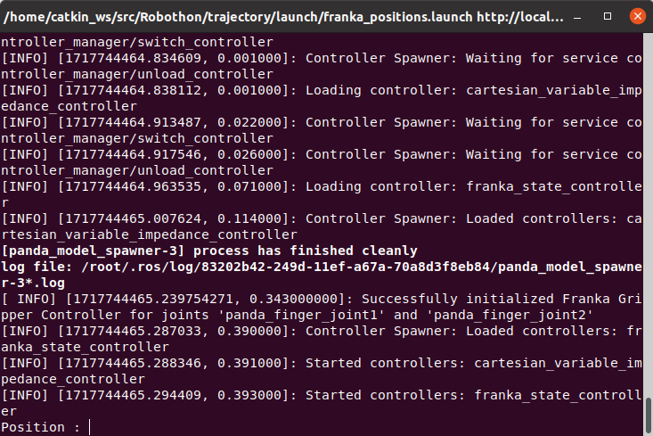

# Commandes pour exécution des tâches

<style>
    .image{
        border: 5px solid #116aa4;
        border-radius: 10px;
        /* padding: 2px; */
    }
    .redlight {
        font-size: 18px; /* Vous pouvez ajuster cette valeur selon vos besoins */
        color: red;
    }
    .bluelight {
        font-size: 18px; /* Vous pouvez ajuster cette valeur selon vos besoins */
        color: blue;
    }
</style>


<p>Avec un repository sur <a class="reference external" href="https://gitlabsu.sorbonne-universite.fr/robothon-sorbonne">gitlabsu</a>, tous les composants logiciels sont disponibles sur ce site et les guides d'installation seront saisies ci-dessous.</p>

## Instructions de téléchargement et d'installation
<p>Sur le repository, on a un package <a class="reference external" href="https://gitlabsu.sorbonne-universite.fr/robothon-sorbonne/docker">Docker</a> qui contient l'image et tous les bash pour l'installation de Docker.</p>

### Installation de Docker incluant déjà tous les packages liés au projet

```bash
$ git clone -b endofproject_zsh https://gitlabsu.sorbonne-universite.fr/robothon-sorbonne/docker.git --recursive

```

### Se placer dans le répertoire docker

```bash
$ cd docker

```

### Installation de l’image Docker

```bash
$ ./install_image.sh

```


### Lancement du Docker

```bash
$ ./start_docker.sh

```

### Lancement de terminator

```bash
$ terminator

```
### Configuration pour la calibration de la caméra et pour RVIZ

```bash
$ apt update
$ apt install --only-upgrade ros-noetic-rqt-rviz ros-noetic-rviz
$ rosdep install -iyr --from-paths src # installation des dépendances pour la calibration avec easy-hand-eye notamment

```

### Construction des dépendances dans catkin_ws

```bash
$ cd catkin_ws
$ catkin_make

```

### Sourcer l'espace de travail catkin_ws au niveau du .bashrc

```bash
$ source_ws # alias défini dans le conteneur pour sourcer le catkin_ws

```

<p>Une fois tout cela terminer, il suffit d'exécuter les différents programmes en fonction des tâches à réaliser</p>

## Commandes pour la simulation des différentes tâches

<p>Un package appelé <a class="reference external" href="https://gitlabsu.sorbonne-universite.fr/robothon-sorbonne/trajectory">trajectory</a>, contient un launchfile principal "<i>franka_positions.launch</i>" permettant de lancer la localisation SIFT à partir de ce package <a class="reference external" href="https://gitlabsu.sorbonne-universite.fr/robothon-sorbonne/box_localization">box_localization</a> contenant un dossier les scripts pour le lancement de SIFT (expliquer sur cette <a class="reference internal" href="SIFT.html">page</a>).</p>

<span class="redlight">Plus d'informations sur les tâches sont données dans la partie "*Primitives des tâches*" !</span>

### Lancement du launchfile franka_positions.launch
Ici, on a la commande pour lancer le superviseur en simulation, avec les paramètres : "*simulation*" initialisé à "`true`" et "*camera*" initialisé à "`false`"

#### Mode simulation
```bash
$ roslaunch trajectory franka_positions.launch
```

#### Mode réel
```bash
$ roslaunch trajectory franka_positions.launch simulation:=false camera:=true
```

#### Activation de la localisation avec la caméra dans un autre terminal
```bash
$ roslaunch box_localization lacalization.launch
```

### Test de simulation pour la tâche du bouton bleu
<p><strong>Dans le terminal, il suffit de saisir :</strong>

```bash
$ Position : blue_button
```

### Test de simulation pour le déplacement de l'effecteur finale vers la position initiale du slider
<p><strong>Dans le terminal, il suffit de saisir :</strong>

```bash
$ Position : slider
```

### Test de simulation pour l'ouverture de la trappe avant le prélèvement au niveau du capteur
<p><strong>Dans le terminal, il suffit de saisir :</strong>

```bash
$ Position : trappe
```

### Test de simulation pour le déplacement du connecteur de la sonde du port noir au port rouge
<p><strong>Dans le terminal, il suffit de saisir :</strong>

```bash
$ Position : connector
```

### Test de simulation pour le grippage de la sonde
<p><strong>Dans le terminal, il suffit de saisir :</strong>

```bash
$ Position : probe
```

### Lancement du launchfile slider.launch

```bash
$ roslaunch trajectory slider.launch
```

### Lancement de toutes les tâches successivement (blue_button, slider, connector, trappe, probe)

```bash
$ Position : all
```

### Positionnement du robot au *repos*
<p><strong>Dans le terminal, il suffit de saisir :</strong>

```bash
$ Position : home (pour une hauteur de 0.5 par rapport à la task-board)
$ Position : home2 (pour une hauteur de 0.25 par rapport à la task-board)
```

<table align="center">
    <tr>
        <th>
            <div class="image"></div>
        </th>
    </tr>
</table>

```{mermaid}
---
caption: Aperçu du terminal lors du lancement du launchfile
align: 'center'
---
graph LR

```

<p>Tous les launchfile exécutés ci-dessus permettent d'avoir la <span class="redlight">simulation</span>, mais pour avoir le mouvement du robot réel, il suffit de rajouter <span class="bluelight">"simulation:=false"</span> qui est par défaut à true dans tous les launchfile.</p>