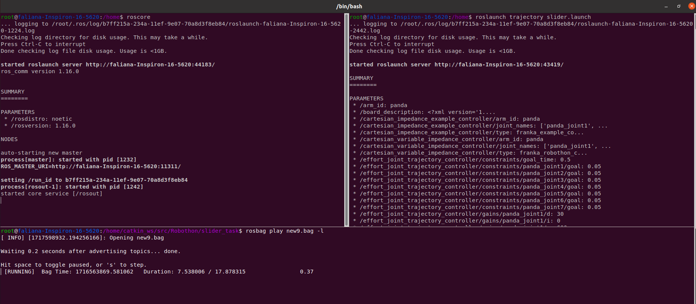
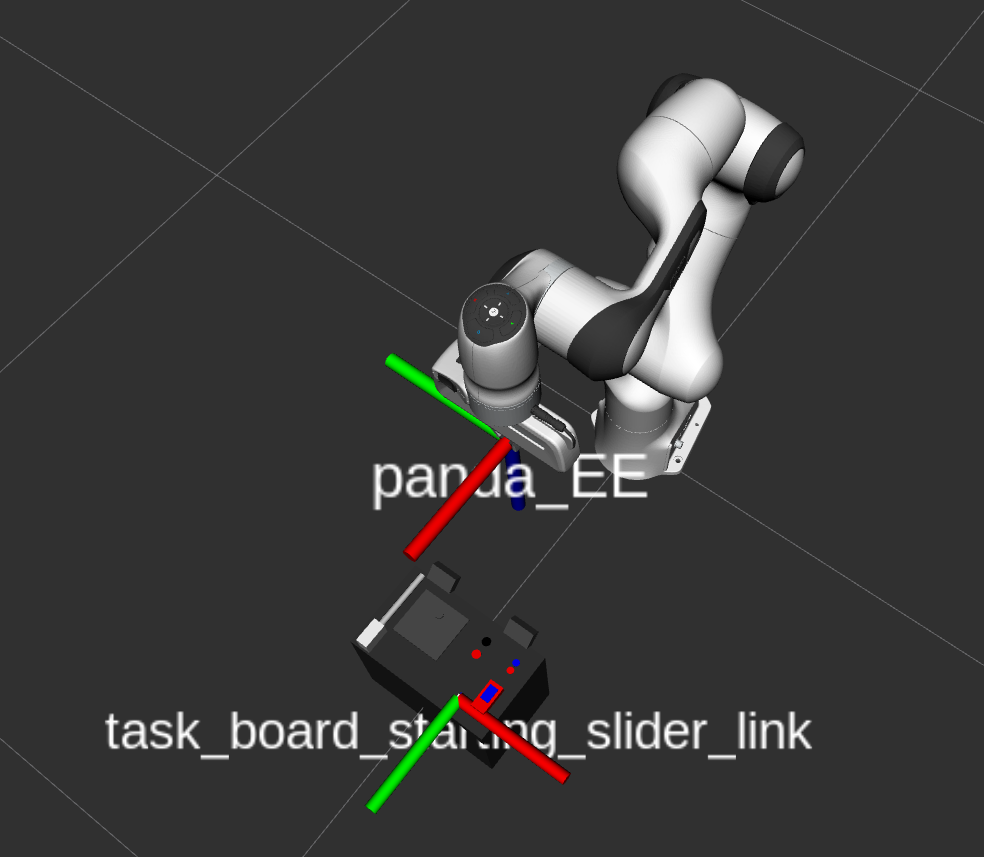
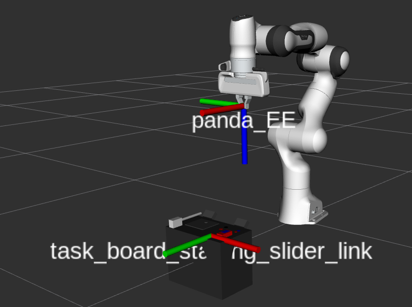
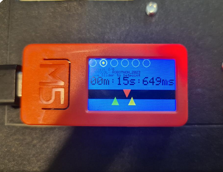
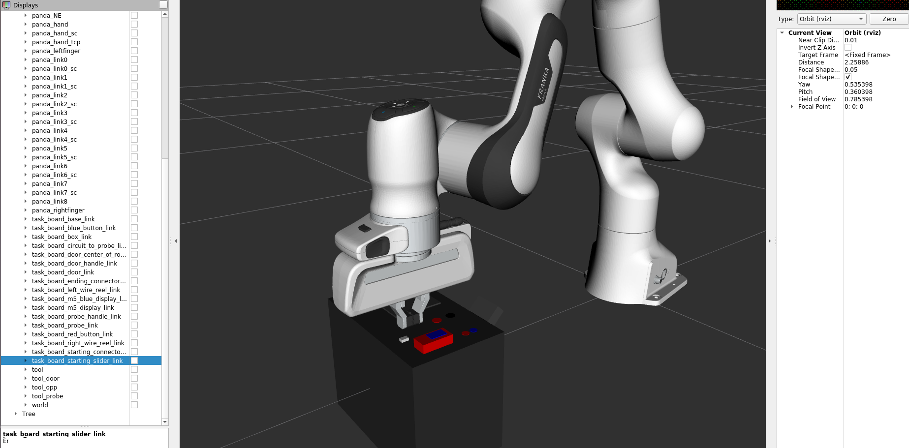
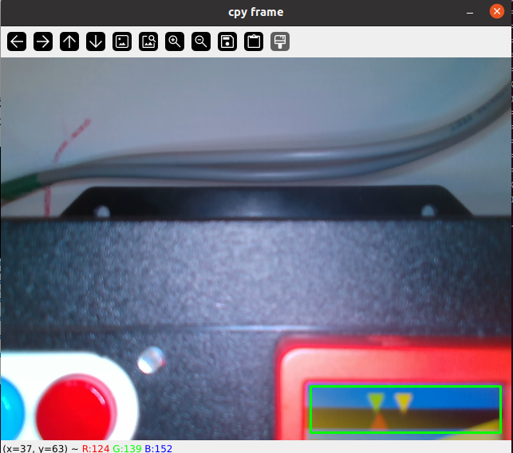
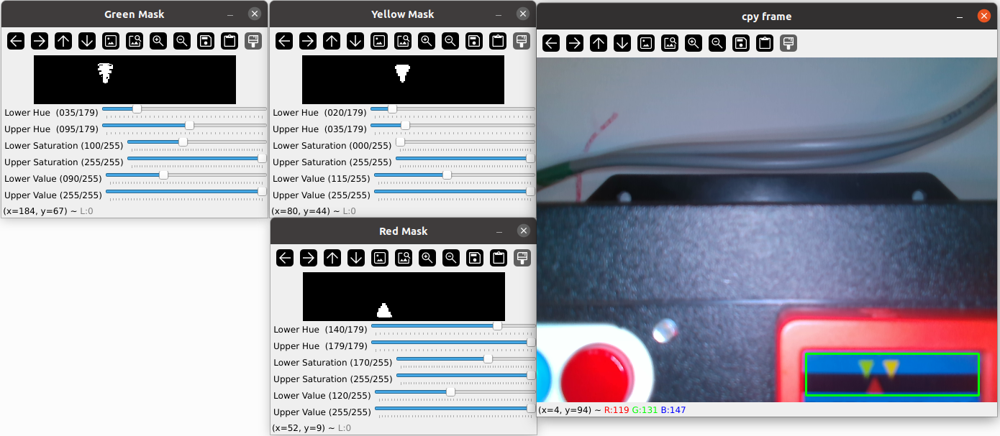
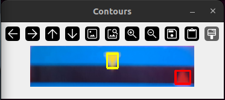
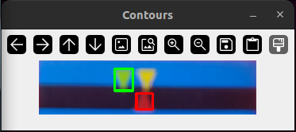

# Tâche du slider

<style>
    .image{
    border: 5px solid #116aa4;
    border-radius: 10px;
    /* padding: 2px; */
    }
</style>

<section id="tache-pour-le-deplacement-du-slider-en-fonction-d-un-retour-visuel">

## Objectifs
<ul class="simple">
<li><p>Aligner le triangle rouge avec le triangle jaune puis le triangle vert,</p></li>
<li><p>Se servir de la caméra et de l’effecteur final pour déplacer le slider selon l’axe (donc une translation),</p></li>
<li><p>Arrêter le déplcement du Panda une fois la tâche accomplie.</p></li>
</ul>
<p><h4>Etapes principales pour la réalisation de la tâche :</h4></p>
<ul class="simple">
<li><p>Positionner l’effecteur final au-dessus de l’écran pour bien percevoir le déplacement des triangles les uns par rapport aux autres,</p></li>
<li><p>Ajuster le grippage des pinces pour saisir correctement le slider,</p></li>
<li><p>Aligner les triangles au niveau de l’écran successivement comme décrit précédemment.</p></li>
</ul>

<table align="center">
  <tr>
    <th>
      <div class="image">
        
      </div>
    </th>
  </tr>
</table>

```{mermaid}
---
caption: Ici, on peut voir trois fenêtres de terminal dans le docker
align: 'center'
---
graph LR

```

<p>Les commandes tapées dans le terminal :</p>
<ul class="simple">
<li><div class="highlight-bash notranslate"><div class="highlight"><pre><span></span>$<span class="w"> </span>roscore
</pre></div>
</div></li>
<li><div class="highlight-bash notranslate"><div class="highlight"><pre><span></span>$<span class="w"> </span>rosbag<span class="w"> </span>play<span class="w"> </span>new9.bag<span class="w"> </span>-l
</pre></div>
</div></li>
<li><div class="highlight-bash notranslate"><div class="highlight"><pre><span></span>$<span class="w"> </span>roslaunch<span class="w"> </span>trajectory<span class="w"> </span>slider.launch<span class="w"> </span>
</pre></div>
</div></li>
</ul>

## Positionnement de l’effecteur final au niveau du slider
<p><h3>Utilisation de ROS :</h3></p>
<ul class="simple">
<li><p>A partir de l’URDF de la "<em>task-board</em>", qui contient déjà des repères ou des TFs au niveau de toutes les composantes 
  (bouton bleu, bouton rouge, slider, bouton M5, position de départ du slider, poignée de la trappe, la sonde, et les deux connecteurs femelles), 
  on peut indiquer au bras de robot d’aller directement au niveau de la TF du slider.</p></li>
</ul>

<table align="center">
  <tr>
    <th>
      <div class="image">
        
      </div>
    </th>
  </tr>
</table>

```{mermaid}
---
caption: Simulation sur RVIZ avec le robot Panda et la task-board présents
align: 'center'
---
graph LR

```

<table align="center" cellspacing="20" cellpadding="5">
  <tr>
    <th>
      <div class="image">
        
      </div>
    </th>
    <th>
      <div class="image">
        
      </div>
    </th>
  </tr>
</table>

```{mermaid}
---
caption: On peut voir ici les deux TFs : celui de l'effecteur final "panda_EE" et celui du slider "task_board_starting_slider_link"
align: 'center'
---
graph LR

```


## Alignement des triangles au niveau de l’écran
### Organisation des codes et des programmes pour le traitement d’image et le déplacement du robot
<ul class="simple">
<li><p>Un script python ("<em>triangle_detection_color.py</em>") permettra de faire le traitement d’image avec tous les masques et filtres intégrés pour la détection des triangles, qui se basera sur l’image capturée par la caméra,</p></li>
<li><p>Un autre script ("<em>slider_controller.py</em>") pour le déplacement de l’effecteur final lui indiquant si oui ou non les triangles sont alignés,</p></li>
<li><p>Un launchfile qui lance ces deux scripts en même temps, gérant en même temps l’aspect simulation et l’aspect réel de la réalisation de la tâche.</p></li>
</ul>

<table align="center">
  <tr>
    <th>
      <div class="image">
        
      </div>
    </th>
  </tr>
</table>

```{mermaid}
---
caption: Image représentant l'écran M5 (avec les trois triangles)
align: 'center'
---
graph LR

```

### Simulation sur RVIZ
<ul class="simple">
<li><p>Utilisation d’un “<em>rosbag</em>” pour simuler le déplacement des triangles en fonction du retour visuel, et intégration du robot avec la task-board sur RVIZ</p></li>
</ul>
<p>Pour enregistrer un <em>bag</em>, on doit saisir dans le terminal, au moment où la caméra capture :</p>
<div class="highlight-bash notranslate"><div class="highlight"><pre><span></span>$<span class="w"> </span>rosbag<span class="w"> </span>record<span class="w"> </span>/topic<span class="w"> </span>--output-name<span class="o">=</span><span class="s2">&quot;name&quot;</span>
</pre></div>
</div>
<p>Pour lancer le <em>bag</em>, il faut saisir :</p>
<div class="highlight-bash notranslate"><div class="highlight"><pre><span></span>$<span class="w"> </span>rosbag<span class="w"> </span>play<span class="w"> </span>nom_du_fichier.bag<span class="w"> </span>-l<span class="w"> </span><span class="o">(</span>pour<span class="w"> </span>lire<span class="w"> </span>le<span class="w"> </span>fichier<span class="w"> </span>en<span class="w"> </span>boucle<span class="w"> </span>en<span class="w"> </span>boucle<span class="o">)</span>
</pre></div>
</div>

<table align="center">
  <tr>
    <th>
      <div class="image">
        
      </div>
    </th>
  </tr>
</table>

```{mermaid}
---
caption: Alignement des TFs entre l'effecteur final et la position de départ du slider
align: 'center'
---
graph LR

```

<table align="center">
  <tr>
    <th>
      <div class="image">
        
      </div>
    </th>
  </tr>
</table>

```{mermaid}
---
caption: Aperçu du bag qui a été enregistré
align: 'center'
---
graph LR

```
<center><p>On voit ici la zone rognée qui nous servira pour le traitement, encadrée en vert.</p></center>


## Méthode de traitement d’image pour distinguer les trois triangles (rouge, vert et jaune)
<ul class="simple">
<li><p>Phase d’initialisation :</p>
<ul>
<li><p>Récupération et affichage du flux vidéo capturé par la caméra (récupération de l’image de la caméra sur RVIZ)</p></li>
<li><p>Détection des centres des trois triangles (détection de formes et de leur gradient)</p></li>
<li><p>Récupérer l’écart de position successif entre les triangles rouge et jaune puis rouge et vert à partir d’un “<em>publisher</em>”</p></li>
</ul>
</li><br>
<li><p>Fonctionnement de la boucle principale :</p>
<ul>
<li><p>Affichage du flux vidéo de la caméra dans une fenêtre</p></li>
<li><p>Application d’une fonction de prétraitement à cette vidéo pour récupérer la zone utile, rognée, de l’écran M5 :</p>
<ul>
<li><p>Conversion en couleur HSV</p></li>
<li><p>Crétaion d’un masque de couleur bleu sur la vidéo avec élimination du bruit environnant</p></li>
<li><p>Détection des contours bleus en définissant une condition sur l’aire</p></li>
<li><p>Et enfin, rogner l’image originale capturée par la caméra</p></li>
</ul>
</li>
<li><p>Traitement sur l’image récupérée :</p>
<ul>
<li><p>Conversion en couleur HSV</p></li>
<li><p>Définition de la plage de couleur bleu et noir</p></li>
<li><p>Appliquer l’addition des masques précédemment sur l’image pour n’avoir que les triangles visibles au final</p></li>
</ul>
</li>
<li><p>Initialisation de plusieurs variables :</p>
<ul>
<li><p>La hauteur de la ligne séparant les triangles jaune et vert, du triangle rouge</p></li>
<li><p>Les centres des triangles en fonction des dimensions maximales d’un triangle avec la hauteur et la largeur (lorsque la caméra est à sa position habituelle, c’est-à-dire lorsque l’effecteur final du robot est en contact direct avec le slider et arrive à le déplacer)</p></li>
</ul>
</li>
</ul>
</li><br>

<table align="center">
  <tr>
    <th>
      <div class="image">
        
      </div>
    </th>
  </tr>
</table>

```{mermaid}
---
caption: Image représentant les 3 fenêtres avec les 3 masques (rouge, vert et jaune)
align: 'center'
---
graph LR

```

<li><p>Phase de détection et contourage des triangles avec plusieurs cas à différencier :</p>
<ul>
<li><p>Détection du triangle jaune :</p>
<ul>
<li><p>Comme il apparaît toujours au centre de l’écran, il est plus simple de définir son contour en vérifiant les conditions,</p></li>
</ul>
</li>
<li><p>Détection du triangle vert :</p>
<ul>
<li><p>Son contour sera détecté à condition qu’il n’est pas centré par rapport à l’image</p></li>
</ul>
</li>
<li><p>Détection de deux triangles qui se superposent :</p>
<ul>
<li><p>C’est le cas où détecte un triangle beaucoup plus large</p></li>
<li><p>On redéfinit donc les centres respectifs des triangles jaune et vert et on dessine le contours du triangle vert</p></li>
</ul>
</li>
<li><p>Détection du triangle rouge :</p>
<ul>
<li><p>Une fois la phase de traitement et de détection des triangles jaune et vert réalisée, on va différencier les coordonnées en x des centres des triangles rouge er jaune lorsqu’un compteur est à 0 (distance entre les triangles rouge et jaune)</p></li>
<li><p>Publication de cet écart sur le topic “ecart_position”</p></li>
<li><p>Lorsque l’écrat se rapproche de 0 avec un écart de +1 ou -1, le compteur passe à 1 (pour signaler que le traitement de la distance entre les triangles rouge et vert est démarré)</p></li>
</ul>
</li>
</ul>
</li>
</ul>

<table align="center" cellspacing="20" cellpadding="5">
  <tr>
    <th>
      <div class="image">
        
      </div>
    </th>
    <th>
      <div class="image">
        
      </div>
    </th>
  </tr>
</table>

```{mermaid}
---
caption: On peut voir ici les deux passages : du triangle rouge au triangle jaune et du triangle rouge au triangle vert
align: 'center'
---
graph LR

```

## Lancement pour la tâche du slider, introduit dans le superviseur

Avec la méthode principale *run* du script "`positions.py`" qui permet de gérer tous les déplacements vers chaque TFs de la task-board en fonction de tâche, incluant celle du slider, on peut atteindre la position initiale du slider :

```bash

$ Position : slider

```

Avec cette commande entrée dans le terminale, l'effecteur finale du bras de robot va se placer pile au dessus de la TF "`task_board_starting_slider_link`" avant de pouvoir exécuter le traitements d'image pour l'alignement des triangles, et en simulation on obtient donc cette configuration :

<table align="center">
  <tr>
    <th>
      <div class="image">
        
      </div>
    </th>
  </tr>
</table>

```{mermaid}
---
caption: Positionnement de l'`End-Effector` au dessus de la TF du point de départ du slider
align: 'center'
---
graph LR

```

## Vidéo de démonstration de la tâche

Ci-dessous, vous aviez à disposition la vidéo d'exécution de la tâche du slider par le bras de robot Panda Franka Emika :

<table align="center">
    <tr>
        <th>
            <div class="image">
            <iframe width="700" height="600" src="https://drive.google.com/file/d/1J9k0EPy1_pLSPzk3RenUN272gEFDdgeK/preview" frameborder="0" allow="autoplay; encrypted-media" allowfullscreen></iframe>
            </div>
        </th>
    </tr>
</table>

```{mermaid}
---
caption: Vidéo d'exécution de la tâche du slider
align: 'center'
---
graph LR

```

</section>