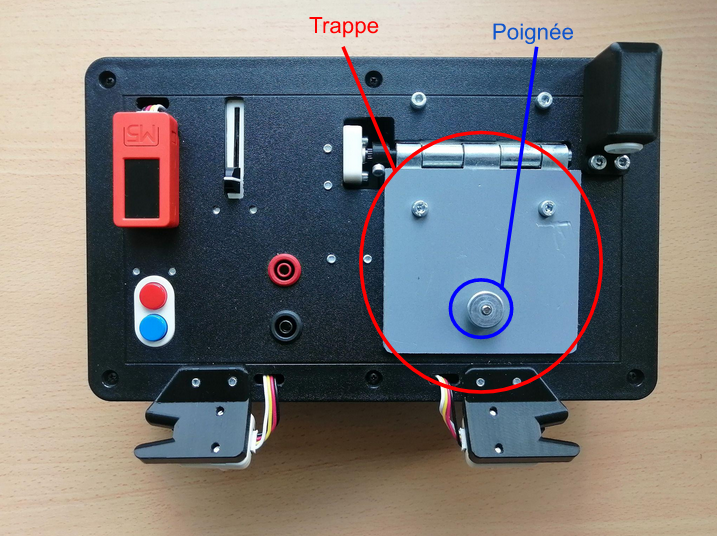

# Tâche de la trappe & sonde (Partie 1)

La première partie de cette tâche consiste à ouvrir la trappe de la taskboard sachant que celle-ci dispose d'une petite poignée circulaire.

<style>
    .image
    {
        border: 5px solid #116aa4;
        border-raduis: 10px;
    }
</style>

<table align="center">
    <tr>
        <th>
        <div class="image">
            
        </div>
        </th>
    </tr>
</table>

```{mermaid}
---
caption: Aperçu de la trappe et poignée sur la task-board
align: 'center'
---
graph LR

```

## Point d'approche

Pour mener à bien cette tâche, au vu de l'état de l'art réalisé en amont, différentes solutions pouvaient être mise en place et envisagée, comme par exemple : utiliser directement la pointe la sonde après l'avoir retirer de son port pour venir ouvrir la trappe ou bien plus simplement par le biais de la pince au bout du gripper.
On a finalement décidé d'écarter la solution d'ouverture avec la pointe de la sonde qui nécessitait une assez grande précision à la fois pour bien se placer au niveau de la fente entre la trappe et la surface supérieure de la task-board pour éviter les mauvaises manipulations qui pourraient endommager le matériel.
Ainsi, pour attrapper la poignéé de la porte et réaliser l'ouverture de la trappe, on se base ici sur les différentes TF intégrées dans le fichier `task_board.urdf` et notamment celles qui nous seront utile, c'est-à-dire "task_board_door_handle_link" et d'une TF statique "tool" correspondante à la pince, comme le montre l'image ci-contre: 


<table align="center" cellspacing="10" cellpadding="5">
    <tr>
        <th>
        <div class="image">
            
        </div>
        </th>
        <th>
        <div class="image">
            
        </div>
        </th>
    </tr>
</table>


```{mermaid}
---
caption: TF de la task_board_door_handle_link et tool
align: 'center'
---
graph LR

```

## Code implémenté

Le script pyhton `trappe.py` développé ici importe la surcharge de la classe Panda et c'est différentes méthodes liées au contrôle, mouvement et trajectoire du bras robot. Voici les étapes successives mises en oeuvre pour effectuer cette tâche : 
- Tout d'abord, on commence par faire un appel à la méthode `go_to_frame` pour placer l'End Effector du robot au niveau de la poignée de la trappe et en procédant à la fermeture de la pince 
- Ensuite, on initialise un tableau de valeur d'angle qui va contenir l'ensemble des angles  successifs de la trajectoire circulaire tout en définissant le point autour duquel celui-ci va être réalisé pour procéder à l'ouverture de la trappe en initialisant une variable de type `PoseStamped`. Cette variable va par la suite être utilisée pour réaliser un changement de repère en passant de `panda_link0` à `task_board_door_hanfle_link` à l'aide de la méthode `get_transform_pose` et donc réaliser la trajectoire circulaire dans le repère de la trappe. Pour résumer, cette étape permet de préparer le robot pour manipuler la poignée de la trappe en ajustant une position de référence autour de laquelle effectuer la trajectoire circulaire.
- Une fois les différents éléments mis en place, on procède à l'interpolation de la trajectoire circulaire voulu par des formules mathématiques de trigonométrie d'un cercle, puis on vient les stocker dans des tableaux de valeurs x, y et z.
- Finalement, la trajectoire est jouée grâce à la méthode `play_trajectory` en spécifiant en arguments les tableaux de valeurs x, y et z définis et complétés précédemment. 
En complément de cela, on utilise les méthodes `move_gripper` et `grasp_gripper` pour l'ouverture et la fermeture du gripper au bon moment au niveau de la saisie de la poignée de la trappe et à la fin de l'ouverture de la trappe.

## Vidéo de démonstration de la tâche

Voici, un aperçu du résultat obtenu : 

<table align="center" cellspacing="10" cellpadding="5">
    <tr>
        <th>
            <div class="image">
            <iframe width="700" height="600" src="https://drive.google.com/file/d/1KBu7pz3RlvSMA3S5E7F3fDo0CSZ_EgRs/preview" frameborder="0" allow="autoplay; encrypted-media" allowfullscreen></iframe>
            </div>
        </th>
        <th>
            <div class="image">
            <iframe width="700" height="600" src="https://drive.google.com/file/d/1_XLY4vAW6Nl6Hj2ZuWd-VnLHYXU9j9nX/preview" frameborder="0" allow="autoplay; encrypted-media" allowfullscreen></iframe>
            </div>
        </th>
    </tr>
</table>
<table align="center">
    <tr>
        <th>
            <div class="image">
            <iframe width="700" height="600" src="https://drive.google.com/file/d/1Su7MCmiW78S82v6dwqasUdwLzUAno0r0/preview" frameborder="0" allow="autoplay; encrypted-media" allowfullscreen></iframe>
            </div>
        </th>
    </tr>
</table>

```{mermaid}
---
caption: Vidéo d'exécution de la tâche de la trappe
align: 'center'
---
graph LR

```

## Problème rencontré

- Quelques petits décalages on pu être réglé et notamment au niveau de la hauteur en z étant donné que lors des premiers essaies en simulation, le bras faisait un mouvement brusque vers l'avant en passant à travers la trappe de la task bard.
Ainsi, pour résoudre ce problème qui intervenait dans la plannification de la trajectoire, on a réadapté certaines méthodes issues de la surchage de la classe Panda pour éviter ce problème. 
- Cependant, un deuxième obstacle dans la réalisation de cette tâche résidait dans le grippage de la pougnée de la trappe qui de part ça forme circulaire n'est pas évidente à attraper et maintenir stable à la même position tout au long de l'interpolation circulaire pour ourvir la trappe, ce qui causait un léger glissement du poignée le long de la pince.

## Mode d'emploi

Ligne de commande à entrer dans le terminal pour exécuter cette tâche : 
- Launchfile superviseur permettant d'indiquer une position cible au Panda : 
```bash
$ roslaunch trajectory franka_positions.launch
```
- Launchfile implémentant le code permettant de réaliser la tâche spécifique de la trappe : 
Ligne de commande à entrer dans le terminal pour exécuter cette tâche : 
```bash
$ roslaunch trajectory trappe.py
```
