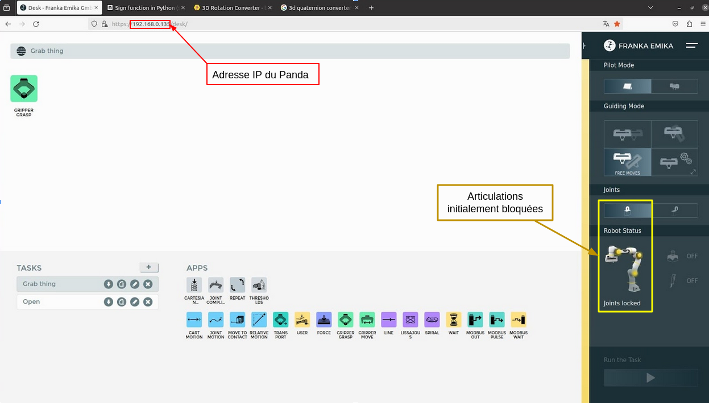
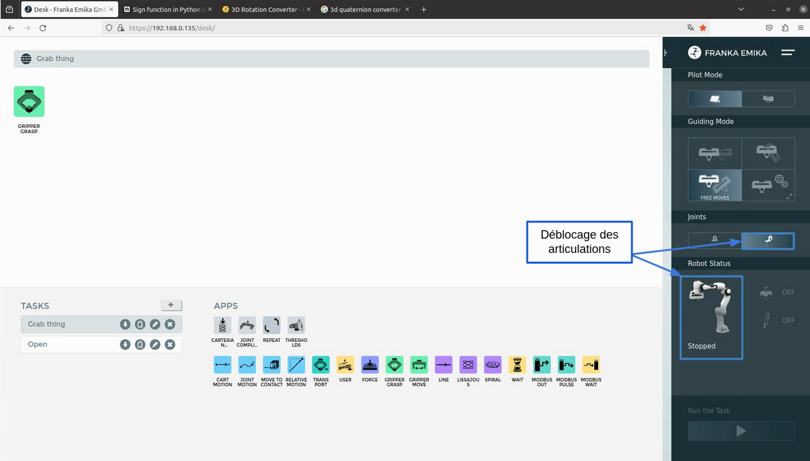
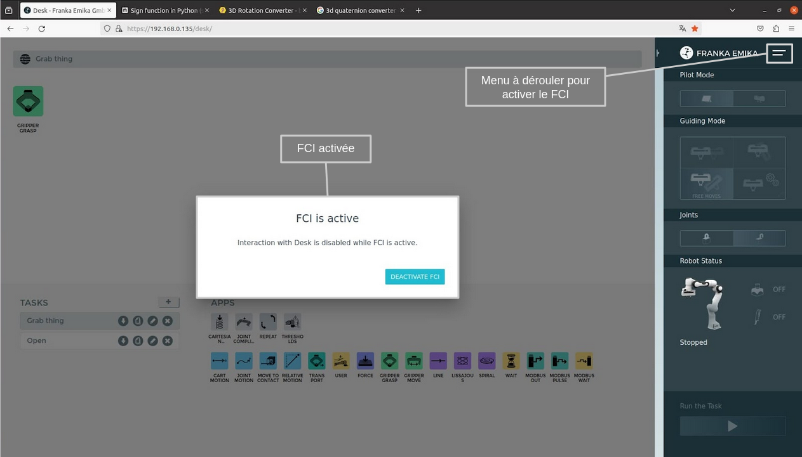

# Utilisation du controlleur du robot

<style>
    .image{
    border: 5px solid #116aa4;
    border-radius: 10px;
    /* padding: 2px; */
    }
</style>

## Lancement de l'interface de contrôle pour pouvoir déplacer le robot

### Instructions pour activer l'interface de contrôle du robot Franka Emika

- Brancher le câble ethernet reliant le contrôleur à l'ordinateur
- Allumer le contrôleur
- Ouvrir un navigateur
- Indiquer l'adresse IP inscrit sur le contrôleur du bras de robot au niveau de la barre de recherche
- Accéder à l'onglet de menu du site, et débloquer toutes les articulations (vous entendrez le débloquage des articulations)
- Activer le "FCI" du robot 
- Une fois activer, le robot est opérationnel

Avant de lancer un programme, s'assurer que le bouton d'arrêt d'urgence (bouton relié au robot et non celui relié à l'alimentation) est bien enfoncé pour éviter tout problème puis le débloquer une fois prêt.

<table align="center">
  <tr>
      <th>
          <th>
            <div class="image"></div>
        </th>
      </th>
  </tr>
</table>

```{mermaid}
---
caption: Page FCI avec les articulations bloquées au début
align: 'center'
---
graph LR

```

<table align="center">
  <tr>
      <th>
          <th>
            <div class="image"></div>
        </th>
      </th>
  </tr>
</table>

```{mermaid}
---
caption: Page FCI avec les articulations débloquées
align: 'center'
---
graph LR

```

<table align="center">
  <tr>
      <th>
          <th>
            <div class="image"></div>
        </th>
      </th>
  </tr>
</table>

```{mermaid}
---
caption: FCI active
align: 'center'
---
graph LR

```