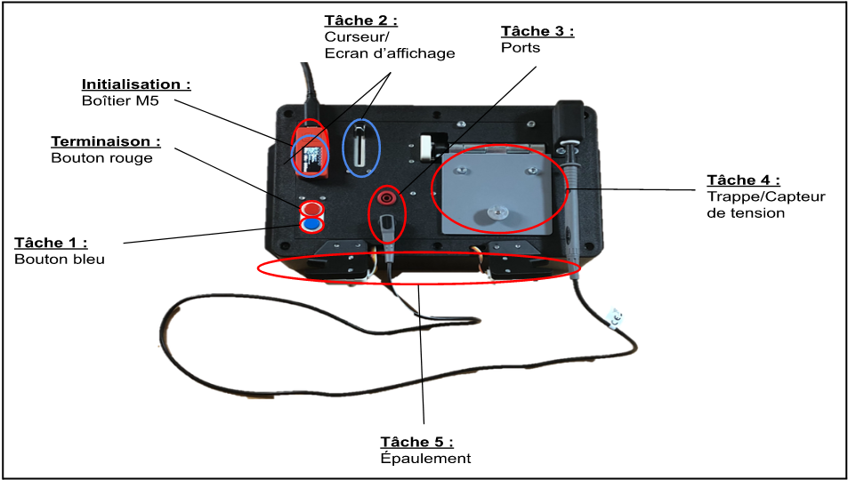
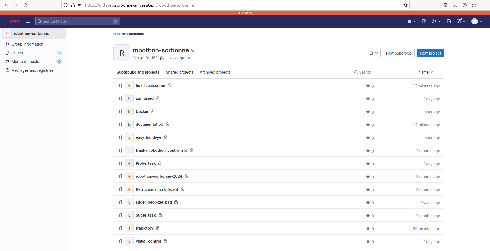

# Rappel du cahier des charges

<style>
    .image{
    border: 5px solid #116aa4;
    border-radius: 10px;
    /* padding: 2px; */
    }
</style>

## Les objectifs fixés par le cahier des charges du projet industriel

- Faire un état de l'art des solutions qui ont fonctionné ou dysfonctionné pendant les précédentes éditions de la comptition;
- Concevoir un préhenseur adapté aux différentes tâches;
- Développer des modules ré-utilisables et open-source pour les différentes tâches;
- Faire une démonstration fonctionnelle en automatique (avec le moins d'interaction humaine possible avec le bars de robot).


## Règles et conditions de la compétition Robothon

Ci-dessous, on aura les conditions théoriques de la compétition avec le déroulement et les modalités d'évaluation des performances :

- La task-board des tâches et les fiches d'essai seront envoyés aux équipes au début de la compétition à la fin du mois de mars.

- Au cours de la période de développement de 30 jours, les équipes doivent développer leur plateforme robotique afin de réaliser des essais au cours desquels elles déplacent la task-board, de son état de départ à son état d'arrivée sans aucune intervention humaine.

- Les équipes seront évaluées sur la base d'une vidéo non coupée de leur robot exécutant leur solution sur la task-board **ET** d'une présentation en direct avec le jury du Grand défi, qui sera programmée lors d'un appel vidéo.

- Avant de commencer un essai, les équipes doivent déplacer la task-board à un endroit aléatoire sur des bandes velcro placées sur une table devant le robot afin d'éviter de préprogrammer des trajectoires de mouvement fixes.

- Une fois l'essai commencé, le robot de chaque équipe doit accomplir l'ensemble des tâches de manière autonome. Toute intervention humaine se traduira par des points négatifs dans le score final de l'équipe.

- Les essais ont une durée maximale de 10 minutes.

- Deux essais au maximum seront autorisés lors de la présentation en direct avec le jury du grand défi. 

- Les équipes qui obtiennent le même nombre de points seront départagées par le temps de parcours total le plus rapide.


## Les différentes tâches que le bras de robot doit réaliser

<div class="context" align="justify">

1. Appuyer sur le bouton bleu,
2. Déplacer un curseur à l’aide de l’effecteur du bras, de sorte à ce que le point du curseur corresponde à la consigne définie sur l’interface (l’écran près du bouton M5) avec l’alignement des triangles (le triangle rouge devra s’aligner avec les triangles jaune et ensuite vert),
3. Gripper le connecteur femelle de la sonde pour le retirer puis l’insérer dans l’autre port de la task board,
4. Ouvrir la trappe et manipuler la sonde afin d’appuyer sur le capteur, présent dans le compartiment en-dessous de la trappe, puis la remettre à sa place initiale (ou sur un support annexe),
5. Enrouler le câble de la sonde autour des deux épaulements montées au bord de la task-board,
6. Arrêt de la task board en appuyant sur le bouton rouge avec la pince.

</div>

<table align="center">
    <tr>
      <th>
        <div class="image">
          
        </div>
      </th>     
    </tr>
</table>

```{mermaid}
---
caption: La description des tâches avec les composantes de la task-board associées
align: 'center'
---
graph LR

```

## Résultats obtenus à partir du cahier des charges

- Un des objectifs principaux de la compétition est de développer des modules et des codes open-source, d'où la création d'un repository sur le gitlab de Sorbonne Université permettant un accès libre aux différents programmes. En terme de réutilisabilité, nos codes ont été commentés, des readme sont présents sur le repo pour expliquer les différents processus d'installation, ou encore expliquant l'arborescence des différents packages et les méthodes utilisées (et pourquoi).

<p>Dans la dynamique du travail collaboratif, on a créé un repository sur gitlabsu (<a class="reference external" href="https://gitlabsu.sorbonne-universite.fr/robothon-sorbonne">https://gitlabsu.sorbonne-universite.fr/robothon-sorbonne</a>) avec différents packages en fonction des tâches et des différents installations qu’il fallait qu’on fasse pour s’harmoniser au niveau du groupe.</p>

<table align="center" cellspacing="10" cellpadding="5" style="width: 70%">
    <tr>
        <th>
            <div class="image"></div>
        </th>
    </tr>
</table>

```{mermaid}
---
caption: Aperçu de la page gitlabsu avec le projet Robothon
align: 'center'
---
graph LR

```

- Vous pouvez voir dans les différentes pages de chaque tâche, une vidéo de démonstration d'exécution :
    - <a class="reference internal" href="bouton-bleu.html">Tâche du bouton bleu</a>
    - <a class="reference internal" href="slider.html">Tâche du slider</a>
    - <a class="reference internal" href="connector.html">Tâche du connecteur de la sonde</a>
    - <a class="reference internal" href="trappe.html">Tâche de la trappe</a>
    - <a class="reference internal" href="sonde.html">Tâche de la sonde</a>
    