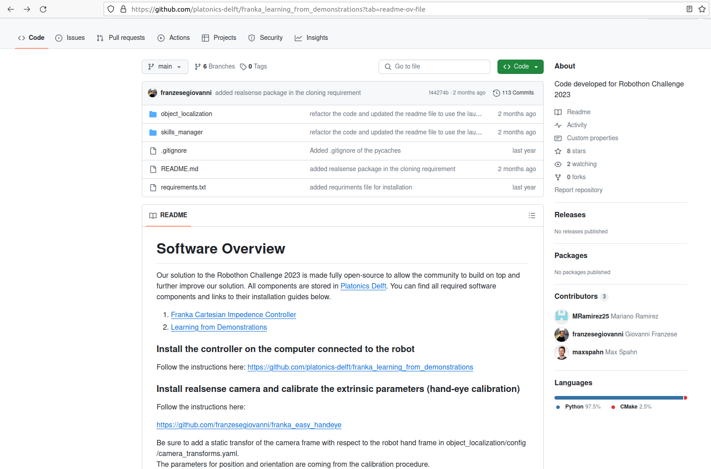

# Ressources réutilisées

<section id="approche-pour-mener-a-bien-le-projet">
<style>
    .image{
    border: 5px solid #116aa4;
    border-radius: 10px;
    /* padding: 2px; */
    }
</style>


## Ressources

<ul class="simple">
<li><p><a class="reference external" href="https://github.com/peterso/robothon-grand-challenge?tab=readme-ov-file">https://github.com/peterso/robothon-grand-challenge?tab=readme-ov-file</a></p></li>
<li><p><a class="reference external" href="https://automatica-munich.com/en/munich-i/robothon/">https://automatica-munich.com/en/munich-i/robothon/</a></p></li>
<li><p><a class="reference external" href="https://wiki.ros.org/">https://wiki.ros.org/</a></p></li>
</ul>

## Résumé de l'état de l'art
<div class="approche" align="justify">

- Ce projet industriel a été pour nous une opportunité d’aprendre à utiliser une plateforme telle que Docker pour faciliter l’organisation du travail dans une équipe, mais aussi pour nous familiariser avec l’OS Linux, et être habitué à l’utilisation du terminale pour l’exécution et la compilation de programmes, mais aussi la découverte d’un nouvel outil, très intéressant et assez important dans la robotique car la majorité des systèmes robotisés l’utilise (on parle ici de ROS).
- Comme il s’agit d’une découverte, on a passé une bonne partie de notre temps à se documenter et à apprendre. Pour mener à bien le projet, on s’est basé sur les différentes solutions développées par les équipes des éditions précédentes de la compétition Robothon, pour s’y inspirer, en prenant les bonnes solutions, en apprenant de leurs erreurs et en optimisant les raisonnements.

- Au niveau de la réalisation de l'état de l'art, on s'est départagé la tâche en 4, en sachant que chacun d'entre nous étudiait les solutions utilisées, ainsi que les différentes méthodes appliquées pour la perception et la planification de trajectoires, par 4 équipes de l'édition 2023 (en sachant qu'ils étaient 16 à avoir participé).
</div>

<table align="center" cellspacing="10" cellpadding="5" style="width: 70%">
    <tr>
        <th>
            <div class="image"></div>
        </th>
    </tr>
</table>

```{mermaid}
---
caption: Aperçu des 16 équipes de l'édition précédente 2023
align: 'center'
---
graph LR

```

## Les éléments tirés de l'équipe Upcyclers

### Modèle 3D de pince adaptée aux différentes tâches

<div class="approche" align="justify">

- Au niveau de la conception d'un préhenseur, on a décidé de réutiliser directement des pinces modélisees par l'équipe "Upcyclers" (ils ont terminé 7ème dans le classement) dans la compétition car on n'a spécialement estimé l'intérêt de modéliser et concevoir un préhenseur entier pour l'exécution des différentes tâches en sachant que ce n'était pas la partie la plus complexe du projet en question. La pince en question est adaptée à pratiquement toutes les tâches comme celle de la sonde car l'évidemment intérieur est adapté à la taille de la sonde, mais aussi pour la saisie du port de la sonde, ainsi pour l'appui sur les bouton car le bout de la pince permet d'avoir une zone de contact réduite mais suffisante. On a juste réadapté l'angle d'orientation de la cavité au centre en passant de 45° à 35°.
</div>


<table align="center" cellspacing="10" cellpadding="5" style="width: 70%">
    <tr>
        <th>
            <div class="image"></div>
        </th>
    </tr>
</table>

```{mermaid}
---
caption: Aperçu de la page github avec le README de l'équipe Upcylers, avec le modèle 3D de la pince
align: 'center'
---
graph LR

```

### Utilisation du modéle 3D de la task-board (l'URDF de la boîte)

<div class="approche" align="justify">

- Pour pouvoir avoir une simulation plus réaliste, on a décidé d'importer un modèle 3D de la task-board sur RVIZ pour pouvoir simuler correctement les mouvements du bras de robot en fonction du positionnement de la task-board par rapport à la base du robot Panda (la base étant repéré par la TF "`panda_link_0`"). Dans cette optique, on a donc repris l'URDF de la task-board développé par cette équipe de l'édition précédente de la compétition (Upcyclers) et on l'a adapté en fonction de nos exigences et de nos différentes méthodes pour réussir chacune des tâches (on parle ici de redéfinition des TFs, modification des différentes composantes physique de la task-board pour l'adapter correctement à la version réelle de la boîte, plus de détailn dans la section suivante où nous parlerons en détail de tous les repères redéfinis au niveau de l'effecteur finale pour faciliter la réalisation de certaines tâches comme celui de la sonde ou encore celui de la trappe).
</div>

<table align="center" cellspacing="10" cellpadding="5" style="width: 100%">
    <tr>
        <th>
            <div class="image"></div>
        </th>
        <th>
            <div class="image"></div>
        </th>
    </tr>
</table>
<table align="center" style="width: 50%">
    <tr>
        <th>
            <div class="image"></div>
        </th>
    </tr>
</table>

```{mermaid}
---
caption: Aperçu de la page github avec le README de l'équipe Upcylers, avec le modèle 3D de la pince
align: 'center'
---
graph LR

```


## Les éléments tirés de l'équipe Platonics

### Ressources bien documentées

- A travers 3 éditions, on a pu remarquer que l’équipe de “**Platonics**”, dont les codes et modules étaient les mieux documentés et rendus open-source à 100%, avait développé des solution très intéressantes, qu’on a pas mal utilisé comme base pour les différentes tâches à accomplir comme la localisation de la task-board avec SIFT.


- Pour le contrôle du robot, comme on a décidé de ne pas utiliser "*moveit*" pour la planification de trajectoires, on s'est donc inspiré du controller qui a été développé par "**Platonics**" pour développer des méthodes permettant au robot d'aller facilement à des positions précis ou avoir la transformation entre deux repères pour permettre au robot d'aller au niveau du repère.


- On a donc eu un premier aperçu des différents codes développés par chaque avec leurs avantages et les inconvénients en fonction des méthodes. En fonction du matériel qui a été à notre disposition (principalement un bras de robot Panda Franka Emika et une caméra Intel RealSense D435i), on a pu s'inspirer et réutiliser les modules et codes développés par l'une des équipes qui a terminé 8ème dans la compétition "*Platonics*".

<table align="center" cellspacing="10" cellpadding="5" style="width: 70%">
    <tr>
        <th>
            <div class="image"></div>
        </th>
    </tr>
</table>

```{mermaid}
---
caption: Aperçu de la page github avec le README de l'équipe Platonics
align: 'center'
---
graph LR

``` 


### Les différents packages exploités

- "`panda-ros-py`" contenant le script <a class="reference external" href="https://github.com/platonics-delft/panda-ros-py/tree/main/panda_ros">panda.py</a>,
- "`object_localization`" contenant les deux scripts nécessaires pour la localisation de la task-board avec SIFT (plus de détails sur le sujet sur cette <a class="reference internal" href="SIFT.html">page</a>),
- "`franka_impedance_controllers`", qui nous a permis de tester pour la première fois, la commande en téléopération du robot Panda Franka Emika à l'aide de marqueurs interactifs, qui nous a permis de comprendre comment relier la simulation sur RVIZ avec le déplacement réel du robot à travers divers launchfile. On a pu obtenir le rendu suivant avec les marqueurs au niveau de l'effecteur finale de la task-board :

<table align="center">
    <tr>
        <th>
            <div class="image"></div>
        </th>
    </tr>
</table>

```{mermaid}
---
caption: Simulation sur RVIZ avec les marqueurs interactifs
align: 'center'
---
graph LR

```

Plus de détails sur la surcharge de la classe "*panda_robothon*" seront donnés sur cette <a class="reference internal" href="surcharge.html">page</a>.


</section>