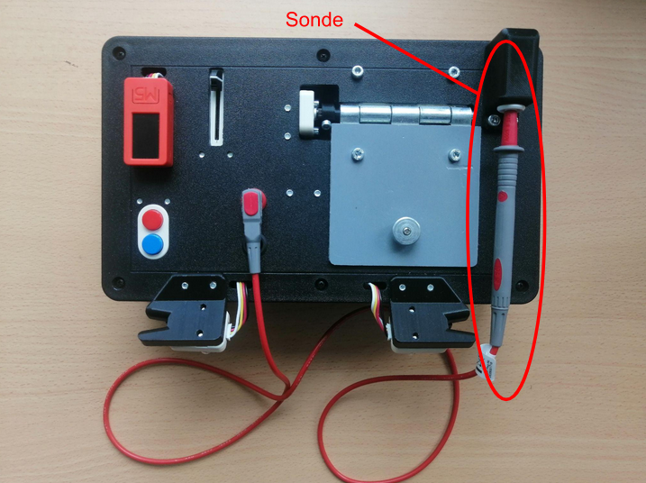
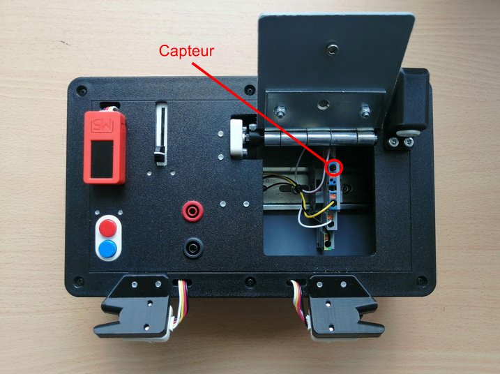
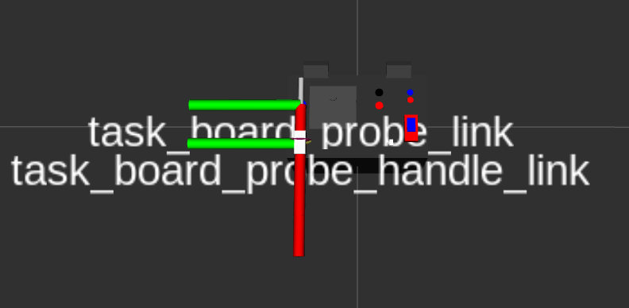
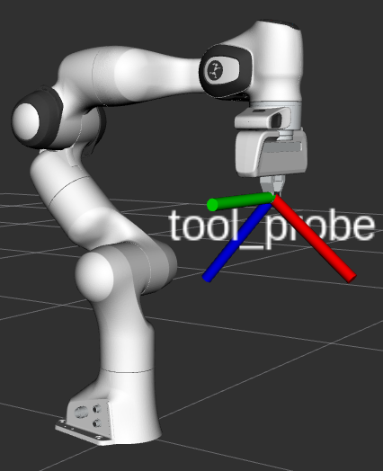
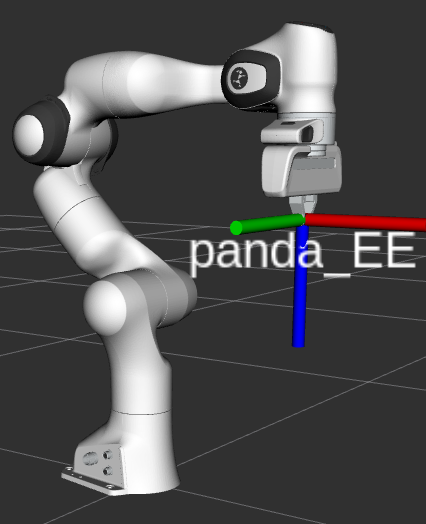
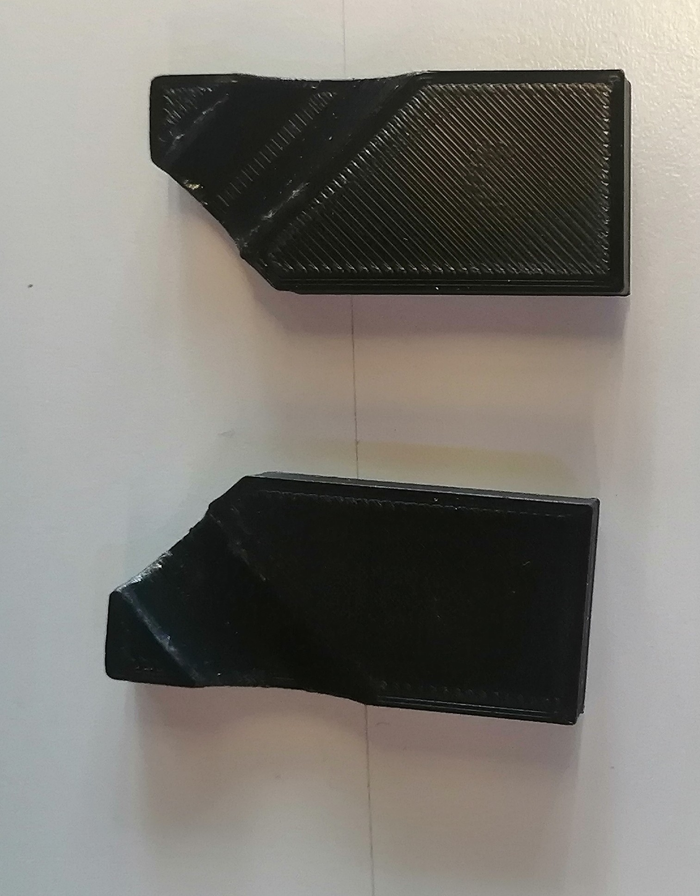
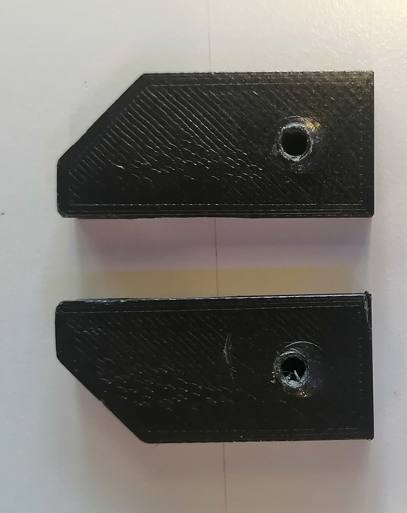
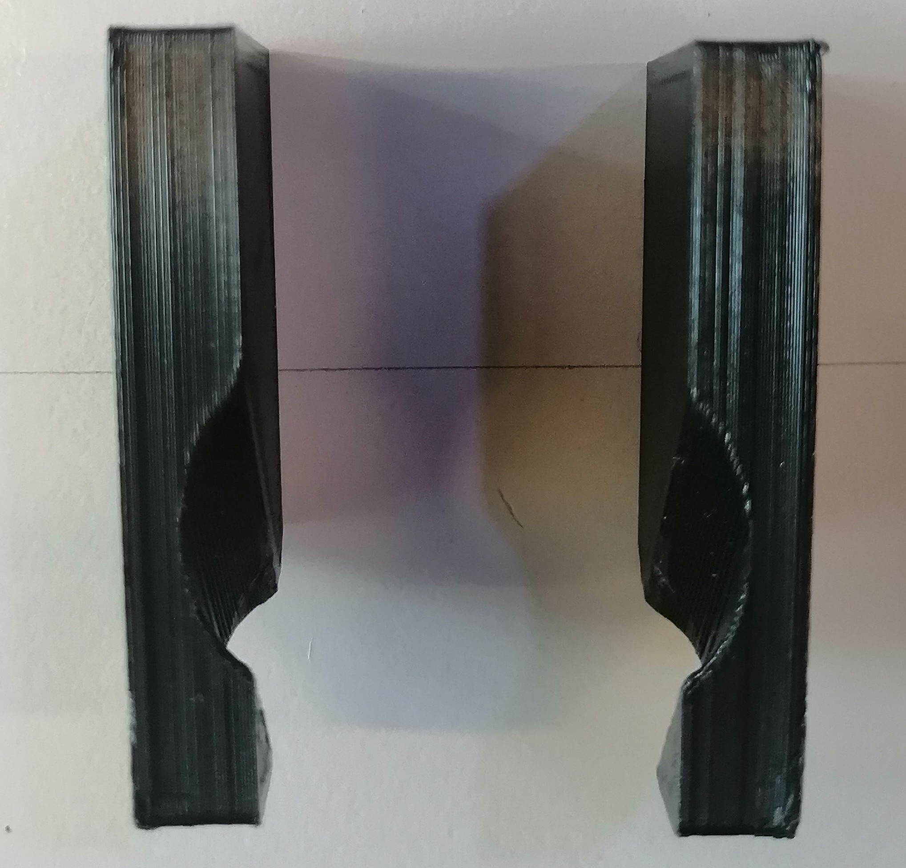
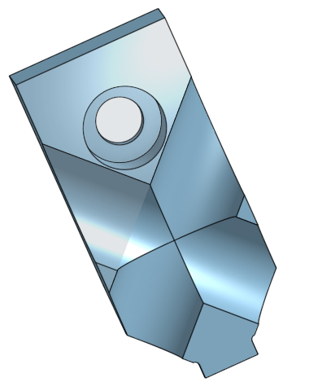
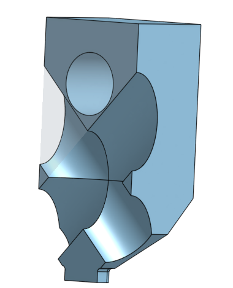

# Tâche de la trappe & sonde (Partie 2)

La seconde partie de cette tâche consiste à déplacer l'End Effector du bras robot au niveau de la sonde puis de la retirer pour ensuite venir prendre une mesure au niveau d'un capteur présent sous la trappe de la task board avec la pointe de la sonde.

<style>
    .image
    {
        border: 5px solid #116aa4;
        border-raduis: 10px;
    }
</style>

<table align="center">
    <tr>
        <th>
        <div class="image">
            
        </div>
        </th>
        <th>
        <div class="image">
            
        </div>
        </th>
    </tr>
</table>

```{mermaid}
---
caption: Aperçu de la sonde dans son port et du capteur de la task-board
align: 'center'
---
graph LR

```

## Point d'approche

Pour réaliser cette tâche qui requiert des trajectoires assez complexes, on fait appel ici à la surcharge de la classe Panda (issue du Github Robothon de l’équipe de Platonics) pour déplacer le robot en fonction des différents repères (TF : TransForm) associées au robot Franka Emika et également à celle de la task-board dont ces dernières sont définies et accessibles dans le fichier `task_board.urdf` et dans lequel, on peut rajouter des TF pour faciliter la planification de la trajectoire pour saisir la sonde et mesurer la tension. 

L’approche ici a donc été de modifier et d’adapter l'une des TF de la taskboard, ici en l'occurrence la "task_board_probe_link" en fonction de sa TF parent la "task_board_probe_handle_link" pour dans un premier temps les avoir alignés et coïncident l'un par rapport à l'autre, comme le montre l'image ci-dessous : 


<table align="center">
    <tr>
        <th>
        <div class="image">
            
        </div>
        </th>
    </tr>
</table>

```{mermaid}
---
caption: TF de la task_board_probe_link et task_board_probe_handle_link
align: 'center'
---
graph LR

```

<!-- <center>
    <br/>
    
    <br/><br/>
    
    <br/>
    <em>Figure - TF de la tool_probe et du panda_EE</em>
    <br/><br/>
</center> -->

Puis, directement dans le fichier launchfile `probe.launch`, on a créé une nouvelle TF statique nommée “tool_probe” définie au niveau du creux du gripper à partir de la TF parent "panda_EE" auquel on vient appliquer une rotation de 40° suivant l'axe y (rerprésenté en vert). De cette manière, l'axe x de la  "tool_probe" qui traverse le long du creux de la pince est en accord avec l'axe x de la sonde redéfini précédemment pour pouvoir par la suite aligner ces deux axes.

<table align="center">
    <tr>
        <th>
        <div class="image">
            
        </div>
        </th>
        <th>
        <div class="image">
            
        </div>
        </th>
    </tr>
</table>
<!-- <table align="center">
    <tr>
        <th>
        <div class="image">
            
        </div>
        </th>
    </tr>
</table> -->

```{mermaid}
---
caption: TF de la tool_probe et du panda_EE
align: 'center'
---
graph LR

```

Le gripper initialement utilisé est celui fournis et vissé de base sur le Panda représenté ci-dessous : 

<table align="center">
    <tr>
        <th>
        <div class="image">
            
        </div>
        </th>
        <th>
        <div class="image">
            
        </div>
        </th>
        <th>
        <div class="image">
            
        </div>
        </th>
    </tr>
</table>

```{mermaid}
---
caption: Modèle 3D du gripper
align: 'center'
---
graph LR

```


Mais par la suite et au final, on a décider de réutiliser le gripper correspondant à celui développé par une des équipes du Robothon de l'édition de 2023 (Upcyclers) qui présentait un outil assez adaptable pour entreprendre chacune des tâches et qui était présent sur le Github Robothon Peterson au lien suivant : https://github.com/hrii-iit/robothon-2023-documentation. Voici, à quoi il ressemble : 

<table align="center">
    <tr>
        <th>
        <div class="image">
            
        </div>
        </th>
        <th>
        <div class="image">
            
        </div>
        </th>
    </tr>
</table>

```{mermaid}
---
caption: Modèle 3D du gripper
align: 'center'
---
graph LR

```

## Code implémenté
    
Au niveau du script python `probe.py` permettant de déplacer le robot à différentes positions en ayant recours au TF de la task-board et du Panda, on importe directement la classe Panda_R issue du script `panda_robothon.py` avec ses nombreuses méthodes facilitant le déplacement du robot, notamment de l’effecteur final de celui-ci vers les différentes composantes de la task-board, comme par exemple : task_board_starting_slider_link, task_board_blue_button_link, task_board_handle_door_link, task_board_probe_link... Et le tout en ayant la possibilité et le choix de conserver l'orientation d'une TF à l'autre si cela est nécessaire. Cette méthode sous le nom de `go_to_frame` qui fait appel à une autre méthode `go_to_tool_pose` a permis de déplacer le Panda avec la bonne orientation de tel sorte à aligner la TF "tool_probe" à celle de la "task_board_probe_link" et donc avoir une inclinaison adéquate pour la saisie de la sonde. 
 
L'étape d'après consistait alors à retirer la sonde de son emplacement, pour cela, il a fallu générliser ce mouvement à toute les orientations possibles de la task-board. Cela a pu être réalisé à l'aide de la méthode `go_to_pose_EE` permettant de se déplacer selon un axe spécifique d'une TF tout en maintenant la même orientation tout au long du mouvement effectué.

En complément de cela, on utilise les méthodes `move_gripper` et `grasp_gripper` pour effectuer la saisie de la sonde lorsque celle-ci est à l'intérieur de son port.

Finalement, une fois la sonde retirée, le but est de relever une mesure au niveau du capteur sous la trappe. Cependant, faute de temps et due à la précision nécessaire pour réaliser ce genre de déplacement, on a décidé de faire l'impasse là dessus pour avancer surle reste du projet.


## Problème rencontré

L'obtacle majeur rencontré à travers cette tâche et auquel on a fait face correspond à l'orientation de la TF `tool_probe` avec celle de la `task_board_probe_link` qui n'était pas en coïcidence quelque soit l'orientation initiale de la task-board. De ce fait, on pouvait se retrouver dans certaines configurations avec des décallages au niveau de l'orientation du gripper du bras et donc effectuer une mauvaise saisie de la sonde (en simulation). Ce problème a pu être résolue en réadaptant et modifiant les méthode `go_to_frame` et `go_to_tool_pose` en passant par des multiplication de matrice de transformation entre les TF suivantes : `panda_link0`, `panda_EE` et `tool_probe`. 


<span style="font-size: 24px;">__Mode d'emploi__</span>

Ligne de commande à entrer dans le terminal pour éxecuter cette tâche : 
```bash
$ roslaunch probe_task probe.py                                                                                                                                                                                                                                             
```

## Vidéo de démonstration de la tâche

Voici un aperçu du résultat obtenu en réel :

<table align="center">
    <tr>
        <th>
            <div class="image">
            <iframe width="700" height="600" src="https://drive.google.com/file/d/1ZZftgEOyXiCT2gR7f_puXjMUQLcJ7obN/preview" frameborder="0" allow="autoplay; encrypted-media" allowfullscreen></iframe>
            </div>
        </th>
    </tr>
</table>

```{mermaid}
---
caption: Vidéo d'exécution de la tâche de la sonde
align: 'center'
---
graph LR

```